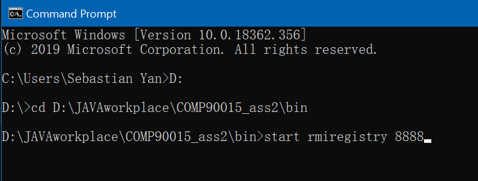
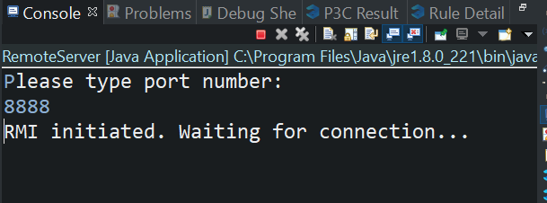
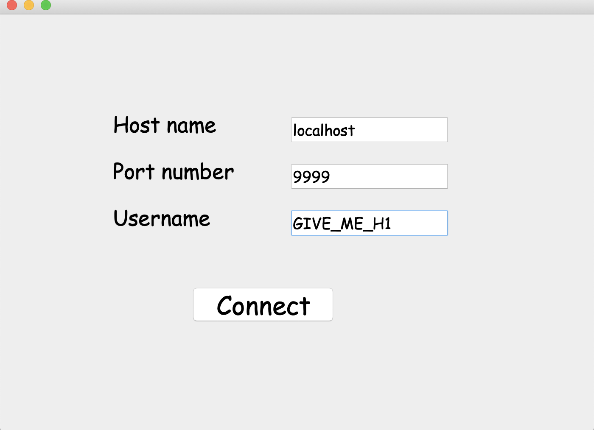
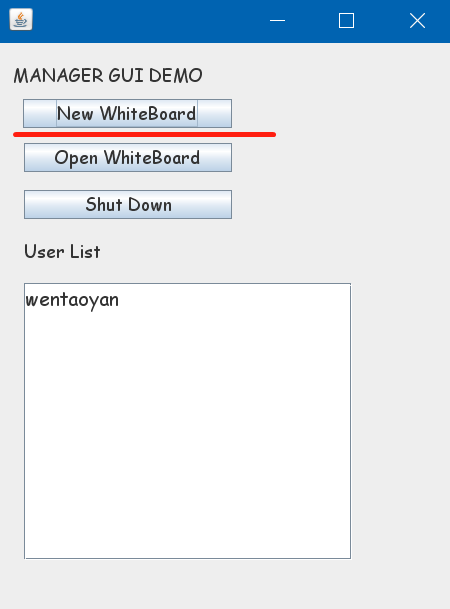

# COMP90015-2019S2-Assignment2
 墨尔本大学2019年S2分布式系统项目文件

## 程序运行方法

1. 启动RMI：

   1. (windows用户)打开控制台并转到工程文件bin目录下;

   2. 输入"start rmiregistry XXXX" (XXXX为registry占用端口号，默认为1099)

      （若提示未安装rmiregistry，请google下载并安装JAVA JDK）

   

2. 启动Server：运行工程文件的“RemoteServer.java”，依照提示输入端口号（需与registry端口号一致）
   
3. 启动Client：

   1. 运行工程文件的“Client_Connection.java”，依照提示输入主机地址，端口号和用户名（主机号：localhost；端口号与以上一致；用户名目前无要求）
   
   2. 进入ClientGUI界面后，选择“New Whiteboard”，开始绘画。
   

## 版本迭代

### 2019/09/29

- 新增管理员GUI界面（managerGUI），并修改两个UI的部分按钮，用于区分管理员与普通用户
- 新增用户列表监听器，实时更新新加入用户
- 尝试解决画板共享问题，无果

### 2019/09/28

- 画板新增“添加文字”功能
- 微调ClinetGUI的按钮名称及其功能
- RMI创建新白板的逻辑更改（一次只能有一个白板），保存功能独立为函数，便于调用

### 2019/09/24

- 新增Client_Connection GUI, 用于方便用户输入hostname, port和username
- ClientGUI新增显示用户名（无实时更新），新增“Create WhiteBoard”和“Open WhiteBoard”按钮  <u>(需小组商讨设计框架)</u>
- 更改对应的RMI函数
- 新增“退出确认”监听行为，用于后台删除用户数据
- 修复部分BUG（扩大whiteboard，但不完美）

### 2019/09/23

- GUI更正：将server GUI 修改为Client GUI，原server输入模式更改为命令行输入

- Client新增用户名输入（计划用于RMI搜集用户信息并展现）。

- RMI新增两个远程函数：openCanvas() 与disposeCanvas()

  （注： 原canvas关闭时仅修改visibility； 若需删除，点击“Disconnect”）

- Canvas更新

  - 新增保存、另存为、绘画预设形状等功能
  - 修复原版本的BUG，更新GUI

### 2019/09/21

- 删除RMI中的Socket等无效代码，增添部分注释
- 增加Canvas（未修改版本），测试客户端远程调用Canvas功能

### 2019/09/20

 - 添加RMI框架

## RMI 代码说明[2019-09-23]

 项目有3个package，分别为client，remote和server。

- client：此package用于实现client的连接以及调用RMI的相关接口。（包含易UI界面，计划用于聊天窗口或显示玩家名）
- remote：此package用于编写RMI接口，以便于client调用。
- server：此package用于实现server、RMI的创建以及RMI接口的实现。
