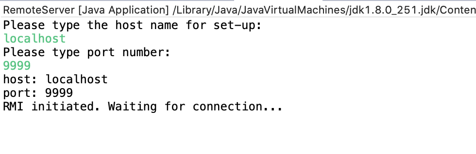
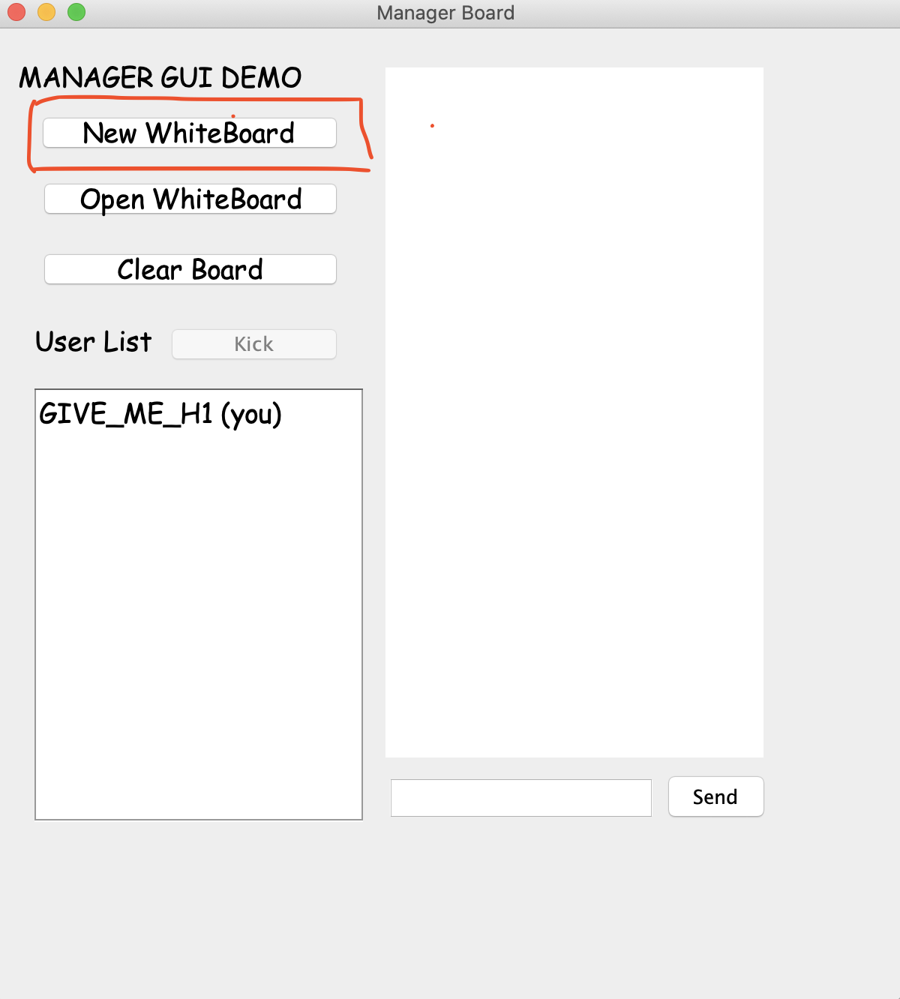

# COMP90015-2019S2-Assignment2
 墨尔本大学2019年S2分布式系统项目文件

## 程序运行方法

1. 启动RMI：

   1. (windows用户)打开控制台并转到工程文件bin目录下;

   2. 输入"start rmiregistry XXXX" (XXXX为registry占用端口号，默认为1099)

      （若提示未安装rmiregistry，请google下载并安装JAVA JDK）

   

2. 启动Server：运行工程文件的“RemoteServer.java”，依照提示输入端口号（需与registry端口号一致）
   
3. 启动Client：

   1. 运行工程文件的“Client_Connection.java”，依照提示输入主机地址，端口号和用户名（主机号：localhost；端口号与以上一致；用户名目前无要求）
   
   2. 进入ClientGUI界面后，选择“New Whiteboard”，开始绘画。
   

## 版本迭代

### v0.8.2 (2019/10/25 12:04pm)

- 修复其余成员下载项目时无法运行的bug
- 删除无用变量和无效文件引用
- 修复少许其余bug

### v0.8.1 (2019/10/24 10:18am)

- 修改部分提示语
- 修复少许BUG
- 取消预先设置RM：第一步直接使用server创建RMI

### v0.8.0 (2019/10/22 11:00pm)

- 新增“Clear”功能
- 新增橡皮擦组件
- 修复部分BUG (Open whiteboard, New Whiteboard, Join Whiteboard, Draw continuous lines等)
- 优化部分提示框展示方式
- （主机端）新增监视器皮肤

### v0.7.0 (2019/10/19 11:35pm)

- **重构RMI框架**：分离客户端（管理员与普通用户）画板、重写共享机制
- 新增主机画板监视器
- 新增“管理员踢人”功能
- 新增聊天窗功能
- 新增“管理员普通用户授权加入画板”功能
- 修复分离后产生的部分bug

### v0.6.1 (2019/10/07 08:56pm)

- 修复clientGUI打开白板后过小
- 修复clientGUI使用可调节大小图形时背景为黑的问题
- 修复clientGUI和managerGUI同时使用可调节大小图形时确认按钮生成的问题

### v0.6.0 (2019/10/07 03:40pm)

- 实现画板共享
- 整合修复后的白板以及画板共享功能
- 新增注释，删减部分无效代码
- 对部分画板关闭后产生的问题进行异常处理

### v0.5.2 (2019/10/06 10:46am)

- 修复单个白板“open”后添加可调节图形时背景为黑色的bug

### v0.5.1  (2019/10/06 09:08pm)

- 新增绘图功能：椭圆、正圆、长方形、正方形的新建后可拖动改变大小及确定机制
- 新增“确定图形”按钮

### v0.5.0  (2019/10/01 10:20pm)

- 新增管理员GUI界面（managerGUI），并修改管理员与普通用户的按钮，便于区分（普通用户按钮功能暂未实现）
- 优化管理员“New Whiteboard”与"Open Whiteboard"按钮之间的逻辑关系
- 新增用户列表监听器，实时更新新加入用户
- 优化部分代码结构，修复程序运行时占用100%内存的问题

### v0.4.1 (2019/09/29 11:54pm)

- 去掉new, fill, bc 三个按钮
- 修改px按钮大小
- 修改默认的px值：1改为3

### v0.4.0 (2019/09/28)

- 画板新增“添加文字”功能
- 微调ClinetGUI的按钮名称及其功能
- RMI创建新白板的逻辑更改（一次只能有一个白板），保存功能独立为函数，便于调用

### v0.3.0 (2019/09/24)

- 新增Client_Connection GUI, 用于方便用户输入hostname, port和username
- ClientGUI新增显示用户名（无实时更新），新增“Create WhiteBoard”和“Open WhiteBoard”按钮  ~~(需小组商讨设计框架)~~
- 更改对应的RMI函数
- 新增“退出确认”监听行为，用于后台删除用户数据
- 修复部分BUG（扩大whiteboard，但不完美）

### v0.2.0 (2019/09/23)

- GUI更正：将server GUI 修改为Client GUI，原server输入模式更改为命令行输入

- Client新增用户名输入（计划用于RMI搜集用户信息并展现）。

- RMI新增两个远程函数：openCanvas() 与disposeCanvas()

  （注： 原canvas关闭时仅修改visibility； 若需删除，点击“Disconnect”）

- Canvas更新

  - 新增保存、另存为、绘画预设形状等功能
  - 修复原版本的BUG，更新GUI

### v0.1.0 (2019/09/21)

- 删除RMI中的Socket等无效代码，增添部分注释
- 增加Canvas（未修改版本），测试客户端远程调用Canvas功能

### v0.1.0（2019/09/20）

 - 添加RMI框架

## RMI 代码说明[2019-09-23]

 项目有3个package，分别为client，remote和server。

- client：此package用于实现client的连接以及调用RMI的相关接口。（包含易UI界面，计划用于聊天窗口或显示玩家名）
- remote：此package用于编写RMI接口，以便于client调用。
- server：此package用于实现server、RMI的创建以及RMI接口的实现。
